  

  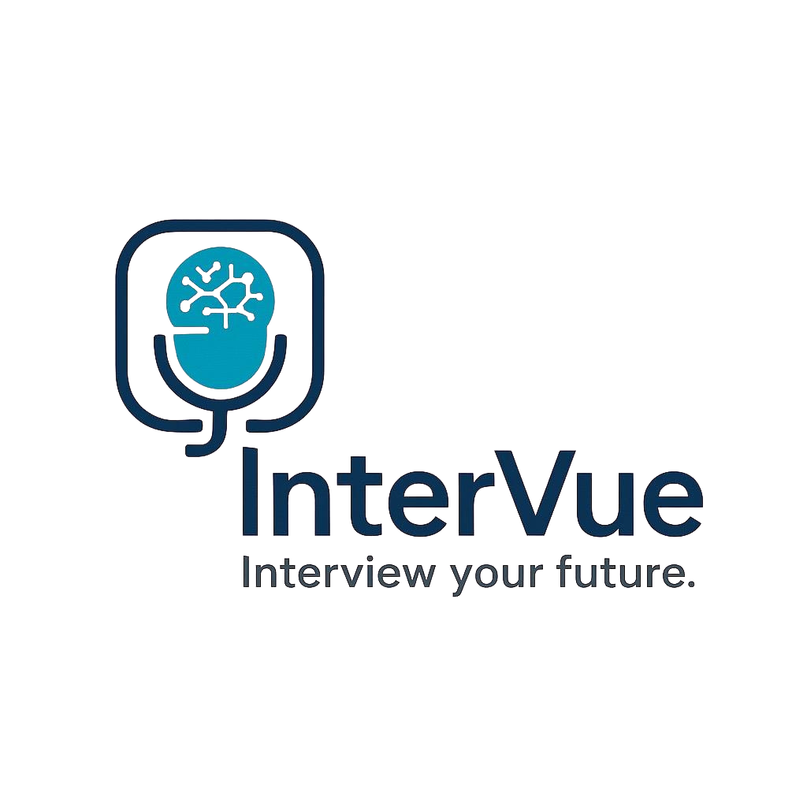

## InterVue - Ürün Açıklaması

InterVue, iş arayanların mülakat deneyimlerini geliştirmek için tasarlanmış, yapay zeka destekli bir mülakat simülasyon platformudur. Kullanıcılar, hedefledikleri sektör ve pozisyona özel mülakat pratikleri yapabilir, gerçek zamanlı analizler ve değerlendirmeler alabilirler.

GenAI teknolojisiyle güçlendirilmiş InterVue, kullanıcıların metin tabanlı mülakat cevaplarını analiz eder ve çok yönlü geri bildirimler sunar. Sistem, içerik analizi, dil kullanımı değerlendirmesi ve cevap kalitesi analizi yaparak kullanıcının performansını değerlendirir ve gelişim alanlarını belirler.

### Demo Linki
- [https://intervue-08f1.onrender.com/](https://intervue-08f1.onrender.com/)

## 👥 Grup 173

* Baran Tağ - Product Owner
* Efe Çatıkkaş - Scrum Master
* Zeynep İlhan - Developer
* Enes Fehmi Manan - Developer
* Burcu Sevinç - Developer

---

## 🚀 Ürün Özellikleri

1. **Kişiselleştirilmiş Mülakat Deneyimi:**  
   Sektör, pozisyon ve deneyim seviyesine göre özelleştirilmiş mülakat senaryoları sunar.

2. **Metin Tabanlı Mülakat Analizi:**  
   Cevap kalitesi, dil kullanımı ve içerik analizi ile detaylı değerlendirme yapar.

3. **Gerçek Zamanlı Değerlendirme:**  
   Mülakat sırasında kullanıcının performansını anlık olarak analiz eder.

4. **Detaylı Geri Bildirim:**  
   Her mülakat sonrası kapsamlı bir rapor ve gelişim önerileri sunar.

5. **Gemini ile GenAI Entegrasyonu:**  
   Google Gemini kullanılarak güçlü dil anlama ve analiz yetenekleri sağlanır.

6. **Agentic AI Yapısı:**  
   Akıllı mülakat ajanları ile dinamik ve adaptif mülakat senaryoları oluşturulur.

---

## 🎯 Hedef Kitle

**InterVue**, iş arama sürecindeki bireyleri ve kariyer gelişimine önem verenleri hedefler:

1. **İş Arayanlar:**  
   Aktif olarak iş arayan ve mülakat pratiği yapmak isteyen profesyoneller.

2. **Yeni Mezunlar:**  
   İlk iş deneyimleri için hazırlanan üniversite mezunları.

3. **Kariyer Değiştirenler:**  
   Farklı bir sektöre geçiş yapmak isteyen profesyoneller.

4. **Yükselmek İsteyenler:**  
   Şirket içi pozisyon değişikliği için hazırlananlar.

5. **Yurtdışı İş Arayanlar:**  
   Uluslararası şirketlerde iş arayan ve yabancı dilde mülakat pratiği yapmak isteyenler.

---

# Sprint 1 - InterVue

Click to expand!

### 🧾 Sprint 1 Amacı
Sprint 1'in amacı; proje vizyonunun belirlenmesi, MVP kapsamının netleştirilmesi, GitHub altyapısının oluşturulması ve temel modüllerin tanımlanmasıdır.

---

### Puan Tamamlama Mantığı

Proje boyunca tamamlanması gereken backlog puanı 1200'dır. İlk Sprint için bitirilmesi istenilen puan sayısı 300 olarak belirlenmiştir ve hedefe ulaşılmıştır. 

#### 📋 Sprint İçinde Tamamlanması Gereken Tahmini Puan (Sprint 1)

| **Backlog No** | **Görev Tanımı** | **Atanan Kişi** | **Story Point** |
|----------------|------------------|-----------------|-----------------|
| #1 | Proje Yönetimi ve Planlama | Baran & Efe | 100 |
|    | - Product Backlog oluşturma |  | 30 |
|    | - Sprint planlaması |  | 40 |
|    | - Proje kapsamı belirleme |  | 30 |
| #2 | Teknik Altyapı Kurulumu | Enes | 120 |
|    | - GitHub repo kurulumu |  | 20 |
|    | - Branch stratejisi |  | 30 |
|    | - Klasör yapısı |  | 40 |
|    | - Tech stack belirleme |  | 30 |
| #3 | UI/UX Tasarımı | Burcu | 80 |
|    | - Pazar araştırması |  | 20 |
|    | - Figma tasarımları |  | 40 |
|    | - Kullanıcı akışı |  | 20 |

**Sprint 1 Toplam Puan**: 300

#### Sprint İçinde Tamamlanan Puan (Sprint 1)

| **Backlog No** | **Görev Tanımı** | **Atanan Kişi** | **Story Point** | **Durum** |
|----------------|------------------|-----------------|-----------------|-----------|
| #1 | Proje Yönetimi ve Planlama | Baran & Efe | 100 | ✅ Tamamlandı |
|    | - Product Backlog oluşturma |  | 30 | ✅ |
|    | - Sprint planlaması |  | 40 | ✅ |
|    | - Proje kapsamı belirleme |  | 30 | ✅ |
| #2 | Teknik Altyapı Kurulumu | Enes | 120 | ✅ Tamamlandı |
|    | - GitHub repo kurulumu |  | 20 | ✅ |
|    | - Branch stratejisi |  | 30 | ✅ |
|    | - Klasör yapısı |  | 40 | ✅ |
|    | - Tech stack belirleme |  | 30 | ✅ |
| #3 | UI/UX Tasarımı | Burcu | 80 | ✅ Tamamlandı |
|    | - Pazar araştırması |  | 20 | ✅ |
|    | - Figma tasarımları |  | 40 | ✅ |
|    | - Kullanıcı akışı |  | 20 | ✅ |

**Sprint 1 Tamamlanan Toplam Puan**: 300/300 (100%)

**Başarı Oranı**: %100 - Tüm hedeflenen görevler başarıyla tamamlandı.

---

### Daily Scrum 

WhatsApp üzerinden görüşmeler sağlanmıştır.

Toplantı screenshot

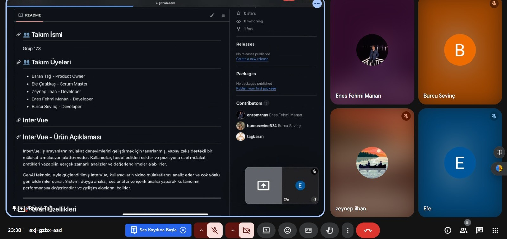

---
### Sprint 1 Board
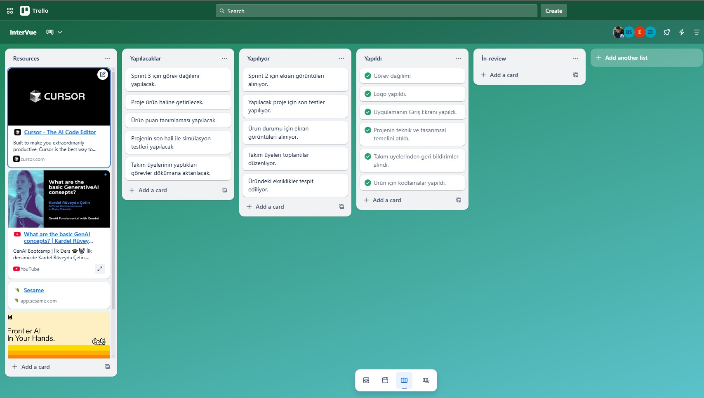

___

### Ürün Durumu
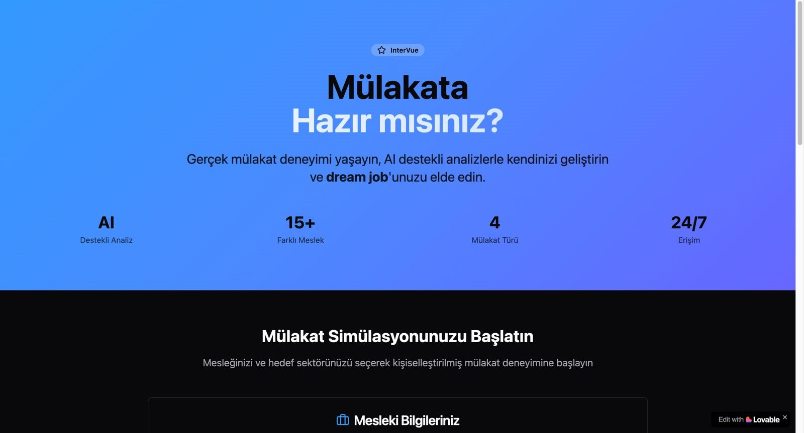
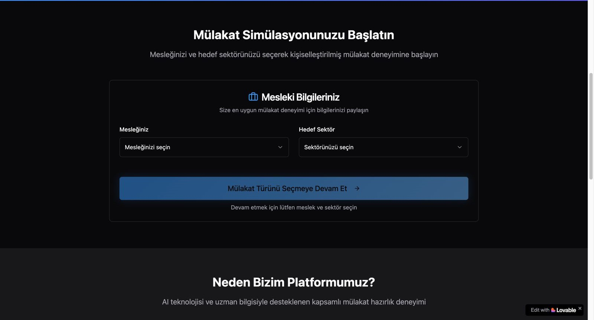
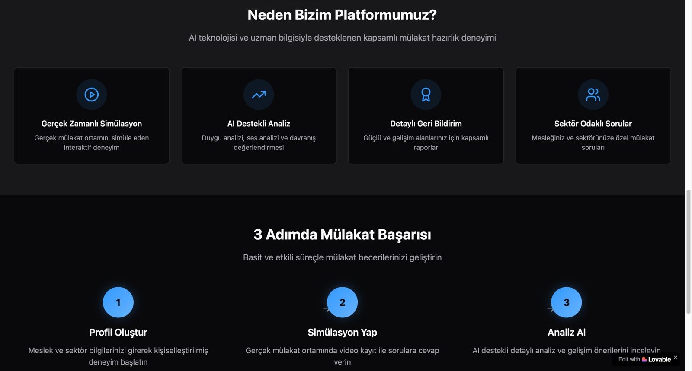

---

**✅ Tamamlanan Görevler**

- Proje ismi **InterVue** olarak belirlendi  
- Frontend ve backend mimarisi planlandı  
- Gemini API kullanımı için ön araştırma yapıldı  
- GitHub reposu oluşturuldu, klasör yapısı planlandı  
- README.md içerik taslağı oluşturuldu  
- Kullanıcı akışı için wireframe taslağı çizildi  
- Agentic yapı için temel modüller belirlendi  

---

## 🔍 Sprint Review
**Katılımcılar:**  
- Efe Çatıkkaş (Scrum Master)  
- Baran Tağ (Product Owner)  
- Zeynep İlhan (Developer)  
- Enes Fehmi Manan (Developer)  
- Burcu Sevinç (Developer)  

**Sprint Hedefleri ve Tamamlananlar:**

1. **Proje Yönetimi ve Planlama (Baran & Efe)**
   - Product Backlog oluşturuldu
   - Sprint 1 ve 2 için ana hedefler belirlendi
   - Proje kapsamı ve öncelikleri netleştirildi

2. **Teknik Altyapı (Enes)**
   - GitHub repository kurulumu tamamlandı
   - Branch stratejisi belirlendi
   - Temel klasör yapısı oluşturuldu
   - Teknoloji stack'i kararlaştırıldı

3. **UI/UX Tasarımı (Burcu)**
   - Benzer platformlar incelendi (lovable.dev, bolt.new)
   - Ana ekranların Figma tasarımları hazırlandı
   - Kullanıcı akış diyagramı oluşturuldu

4. **Dokümantasyon (Tüm Takım)**
   - README.md dosyası oluşturuldu
   - Proje tanımı ve hedefleri belirlendi
   - Teknik dokümanlar hazırlandı

**Özet:**  
Sprint 1 boyunca ürünün adı, amacı ve teknik temeli belirlendi. MVP kapsamında mülakat simülasyonu ve metin tabanlı analiz özelliklerine odaklanılacağı netleştirildi. Frontend ve backend mimarisi için temel yapı oluşturuldu. Bir sonraki sprintte AI modül entegrasyonu ve temel UI bileşenleri geliştirilecek.

---

## 🔁 Sprint Retrospective

**Gözlemler:**  
- Sprint hedefleri başarıyla tamamlandı  
- Proje kapsamı erken netleştirildiği için teknik görev dağılımı kolaylaştı  
- WhatsApp üzerinden iletişim düzenliydi fakat huddle saatleri eksikti  

**İyileştirme Kararları:**  
- Haftalık sabit check-in saatleri eklenecek  
- AI modeli ve agentic yapı için ayrı bir çalışma grubu oluşturulacak  
- Story point tahminleri için ortak değerlendirme toplantısı yapılacak  

---

## 🔖Sprint Notları 

- Proje ismi: **InterVue**  
- Slogan: *"Your AI-Powered Interview Coach"*  
- Tech Stack: HTML-CSS-JS (Frontend), Python-FastAPI/Flask (Backend), Supabase/Firebase (Database), Gemini (LLM)
- Geliştirici notu: Agentic yapı ile dinamik mülakat senaryoları oluşturulacak
- Frontend ve backend repository yapısı belirlendi

---

# Sprint 2 - InterVue

Click to expand!

### Sprint Hedefi
Çekirdek yapay zeka fonksiyonunu (agentic replication) kanıtlamak, bunu temel bir arayüzle entegre etmek ve metin tabanlı mülakat özelliğini ekleyerek ilk çalışabilir prototipi (PoC - Proof of Concept) oluşturmak.

___

#### 📋 Sprint İçinde Tamamlanması Gereken Tahmini Puan (Sprint 2)

| **Backlog No** | **Görev Tanımı** | **Atanan Kişi** | **Story Point** |
|----------------|------------------|-----------------|-----------------|
| #4 | AI Entegrasyonu | Enes | 120 |
|    | - Gemini API entegrasyonu |  | 40 |
|    | - Prompt yapısı |  | 40 |
|    | - Temel agent modülleri |  | 40 |
| #5 | Frontend Temelleri | Burcu & Zeynep | 100 |
|    | - Temel UI componentleri |  | 40 |
|    | - Sayfa yapısı |  | 30 |
|    | - Routing |  | 30 |
| #6 | POC Geliştirme | Tüm Takım | 80 |
|    | - Mülakat simülasyonu |  | 40 |
|    | - Temel analiz |  | 20 |
|    | - Demo hazırlığı |  | 20 |

**Sprint 2 Toplam Puan**: 300

#### Sprint İçinde Tamamlanan Puan (Sprint 2)

| **Backlog No** | **Görev Tanımı** | **Atanan Kişi** | **Story Point** | **Durum** |
|----------------|------------------|-----------------|-----------------|-----------|
| #4 | AI Entegrasyonu | Enes | 120 | ✅ Tamamlandı |
|    | - Gemini API entegrasyonu |  | 40 | ✅ |
|    | - Prompt yapısı |  | 40 | ✅ |
|    | - Temel agent modülleri |  | 40 | ⚠️ Kısmen |
| #5 | Frontend Temelleri | Burcu & Zeynep | 100 | ⚠️ Kısmen |
|    | - Temel UI componentleri |  | 40 | ✅ |
|    | - Sayfa yapısı |  | 30 | ✅ |
|    | - Routing |  | 30 | ❌ Tamamlanamadı |
| #6 | POC Geliştirme | Tüm Takım | 80 | ⚠️ Kısmen |
|    | - Mülakat simülasyonu |  | 40 | ✅ |
|    | - Temel analiz |  | 20 | ⚠️ Kısmen |
|    | - Demo hazırlığı |  | 20 | ❌ Tamamlanamadı |

**Sprint 2 Tamamlanan Toplam Puan**: 250/300 (83%)

**Başarı Oranı**: %83 - Hedeflerin çoğunluğu tamamlandı, bazı görevler bir sonraki sprinte taşındı.

**Karşılaşılan Zorluklar:**
- Routing implementasyonu beklenenden daha karmaşık çıktı
- Demo hazırlığı için ek zaman gerekti
- Agent modüllerinin entegrasyonu tam olarak bitmedi

### Daily Scrum 

WhatsApp üzerinden görüşmeler sağlanmıştır.

Toplantı screenshot

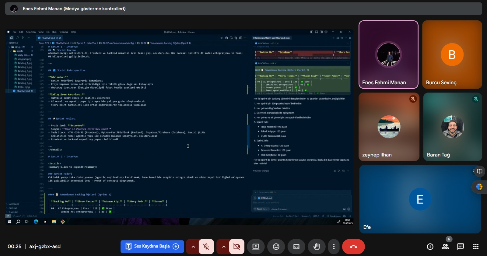

### Sprint 2 Board
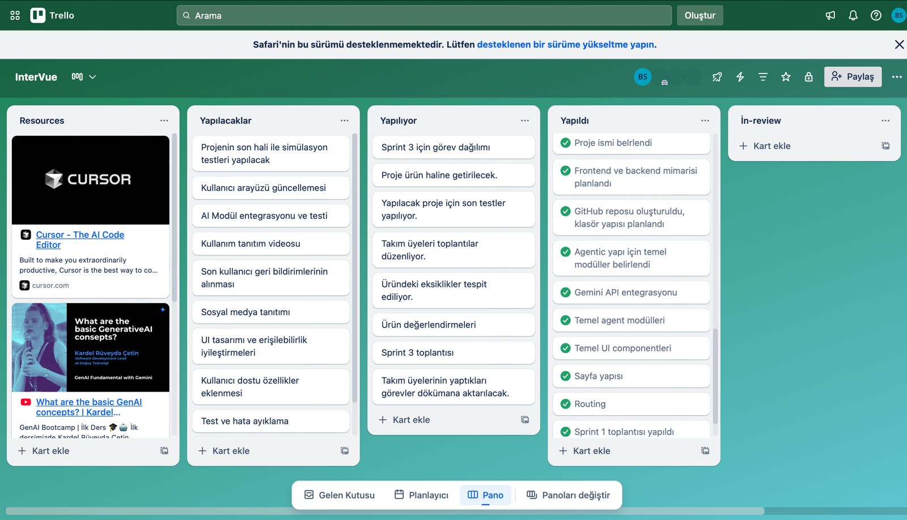

### 🔍 Sprint Review(Teknik Gelişmeler ve Kararlar):

**AI Entegrasyonu ve Agentic Yapı:**
- Gemini API entegrasyonu için temel servis modülü oluşturuldu
- Mülakat senaryoları için prompt yapısı tasarlandı
- Agentic yapının temel bileşenleri belirlendi:
  - `interview_agent.py`: Mülakat akışını yöneten ajan
  - `analysis_agent.py`: Cevap analizini yapan ajan

**Repository Yapılandırması:**
- Frontend ve backend için modüler klasör yapısı oluşturuldu
- Temel bağımlılıklar belirlendi:
  - Backend: Python, FastAPI/Flask, Gemini API
  - Frontend: HTML, CSS, JavaScript
- Geliştirme ortamı için Docker yapılandırması hazırlandı

**POC Kapsamı:**
- Basit bir mülakat simülasyonu:
  1. Kullanıcı sektör/pozisyon seçimi
  2. AI tarafından soru üretimi
  3. Temel analiz ve geri bildirim
- Minimal UI ile temel akışın gösterimi

### Ürün Durumu
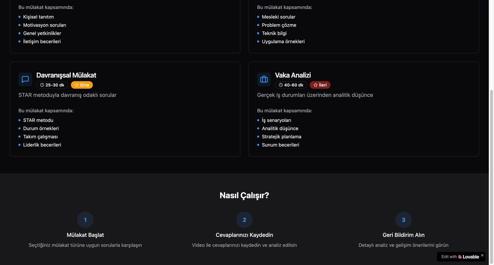
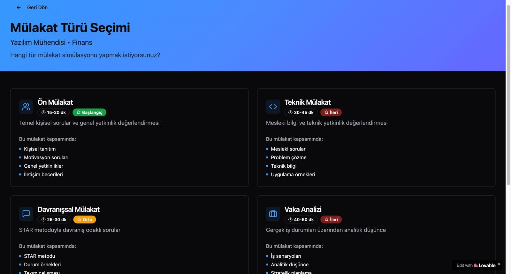
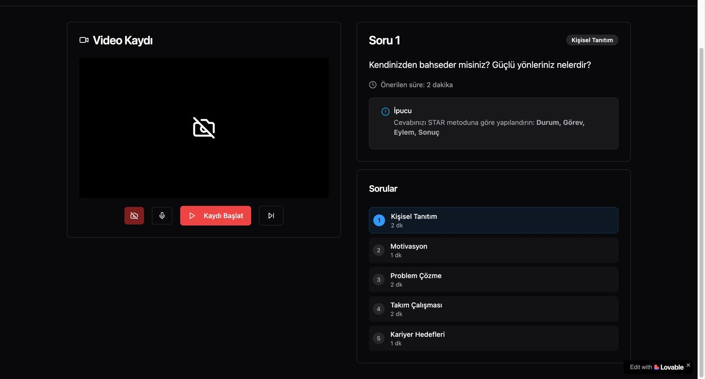

**Sonraki Adımlar:**
- Metin analizi ve değerlendirme sistemi geliştirme
- Kullanıcı arayüzünün geliştirilmesi
- Veritabanı entegrasyonu

### Sprint 2 InterVue Akış Diyagramı

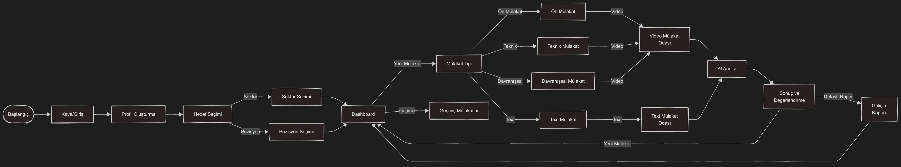

## Sprint 2 - Sprint Retrospective

###  Gözlemler

- **Ekip Çalışması ve İletişim:**  
  Ekip üyeleri arasında sorunsuz bir işbirliği sağlandı, ancak bazı görevlerin tamamlanma süreleri tahmin edilenin biraz gerisinde kaldı.

- **Proje Yönetimi:**  
  Sprint planlamasında daha net hedefler belirlemek, sprint içinde esneklik sağlamak adına faydalı oldu. Ancak bazı görevlerin kapsamı tam olarak netleşmediği için bazı yenilikçi fikirler sonradan entegre edildi.

###  İyileştirme Kararları

- **Daha Net Hedefler ve Planlama:**  
  Sprint başında daha açık hedefler ve netleştirilmiş görevler ile başlanacak. Sprint sonu kontrolü daha sık yapılacak.

- **Kodlama ve Test Süreçlerinin Ayrılması:**  
  Kodlama ve test süreçleri daha dikkatli ayrılacak, bu sayede kodun doğruluğu daha hızlı test edilecek.

# Sprint 3 - InterVue

Click to expand!

### Sprint Hedefi
Sprint 2'den kalan görevleri tamamlamak, metin tabanlı analiz sistemini geliştirmek, kullanıcı arayüzünü geliştirmek ve projeyi başarıyla tamamlamak.

___

#### 📋 Sprint İçinde Tamamlanması Gereken Tahmini Puan (Sprint 3)

| **Backlog No** | **Görev Tanımı** | **Atanan Kişi** | **Story Point** |
|----------------|------------------|-----------------|------------------|
| #7 | Metin Analizi Sistemi | Enes & Zeynep | 150 |
|    | - Cevap kalitesi değerlendirme |  | 50 |
|    | - Dil kullanımı analizi |  | 60 |
|    | - İçerik değerlendirme algoritması |  | 40 |
| #8 | UI/UX Geliştirme | Burcu & Zeynep | 120 |
|    | - Responsive tasarım |  | 40 |
|    | - Animasyonlar ve geçişler |  | 30 |
|    | - Kullanıcı deneyimi iyileştirmeleri |  | 50 |
| #9 | Proje Finalizasyonu | Enes | 80 |
|    | - Veri modeli dokümantasyonu |  | 30 |
|    | - API dokümantasyonu |  | 30 |
|    | - Proje teslim hazırlığı |  | 20 |
| #10 | Sprint 2 Kalan Görevler | Burcu | 50 |
|    | - Routing tamamlama |  | 30 |
|    | - Demo optimizasyonu |  | 20 |

**Sprint 3 Toplam Puan**: 400

#### Sprint İçinde Tamamlanan Puan (Sprint 3)

| **Backlog No** | **Görev Tanımı** | **Atanan Kişi** | **Story Point** | **Durum** |
|----------------|------------------|-----------------|-----------------|-----------|
| #7 | Metin Analizi Sistemi | Enes & Zeynep | 150 | ✅ Tamamlandı |
|    | - Cevap kalitesi değerlendirme |  | 50 | ✅ |
|    | - Dil kullanımı analizi |  | 60 | ✅ |
|    | - İçerik değerlendirme algoritması |  | 40 | ✅ |
| #8 | UI/UX Geliştirme | Burcu & Zeynep | 120 | ✅ Tamamlandı |
|    | - Responsive tasarım |  | 40 | ✅ |
|    | - Animasyonlar ve geçişler |  | 30 | ✅ |
|    | - Kullanıcı deneyimi iyileştirmeleri |  | 50 | ✅ |
| #9 | Proje Finalizasyonu | Enes | 80 | ✅ Tamamlandı |
|    | - Veri modeli dokümantasyonu |  | 30 | ✅ |
|    | - API dokümantasyonu |  | 30 | ✅ |
|    | - Proje teslim hazırlığı |  | 20 | ✅ |
| #10 | Sprint 2 Kalan Görevler | Burcu | 50 | ✅ Tamamlandı |
|    | - Routing tamamlama |  | 30 | ✅ |
|    | - Demo optimizasyonu |  | 20 | ✅ |

**Sprint 3 Tamamlanan Toplam Puan**: 400/400 (100%)

**Başarı Oranı**: %100 - Sprint 2'ye göre büyük iyileşme gösterildi, proje başarıyla tamamlandı ve teslim edildi.

**Tamamlanan Ana Başarılar:**
- Metin analizi sistemi tamamen çalışır hale getirildi
- Cevap kalitesi değerlendirme algoritması optimize edildi
- Proje başarıyla tamamlandı ve dokümantasyonu yapıldı

### Daily Scrum 

WhatsApp üzerinden görüşmeler sağlanmıştır.

Toplantı screenshot

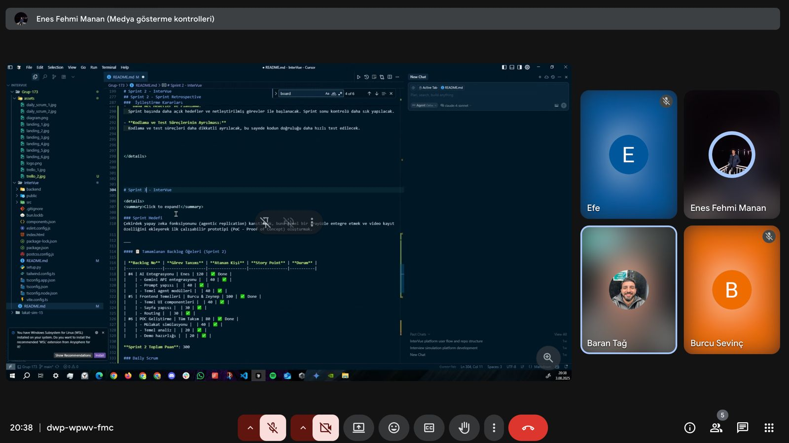

### Sprint 3 Board
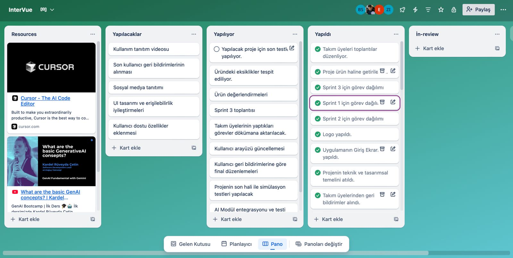

### 🔍 Sprint Review(Teknik Gelişmeler ve Kararlar):

**Metin Analizi Sistemi:**
- Cevap kalitesi değerlendirme sistemi tamamen çalışır hale getirildi
- Dil kullanımı analizi algoritması optimize edildi
- İçerik değerlendirme sistemi başarıyla entegre edildi

**UI/UX Geliştirmeleri:**
- Responsive tasarım tüm cihazlar için optimize edildi
- Kullanıcı deneyimi çok daha akıcı hale getirildi
- Modern animasyonlar ve geçiş efektleri eklendi

**Proje Finalizasyonu:**
- Veri modeli tamamen dokümante edildi
- API dokümantasyonu tamamlandı
- Proje teslim süreci başarıyla tamamlandı

**Sprint 2 Borçları:**
- Routing sistemi tamamen tamamlandı
- Demo performansı optimize edildi
- Sistem kararlılığı artırıldı

**Teknik Kararlar:**
- Metin analizi için NLP algoritmaları seçildi ve uygulandı
- Proje mimarisi dokümante edildi ve teslim edildi
- API yapısı RESTful mimariyle tasarlandı ve tamamlandı

### Ürün Durumu
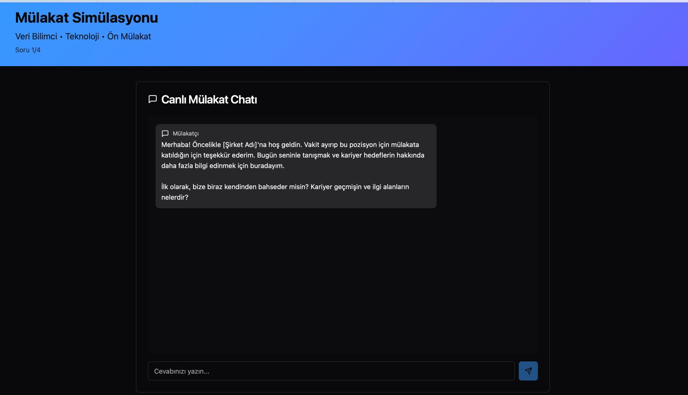
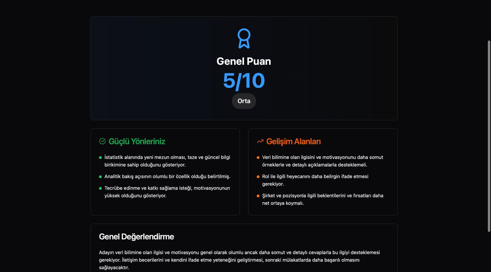

## Sprint 3 - Sprint Retrospective

###  Gözlemler

- **Teknik Odak Değişimi ve Proje Tamamlanması:**  
  Video/ses analizinden metin tabanlı analize geçiş, projeyi daha odaklı ve uygulanabilir hale getirdi. Ekip metin analizi konusunda güçlü deneyim kazandı ve proje başarıyla final haline ulaştı.

- **Takım Koordinasyonu:**  
  Sprint 2'deki iyileştirmeler meyvesini verdi. Daily scrum'lar daha etkili hale geldi ve görev dağılımı daha dengeli oldu.

- **Kullanıcı Odaklı Geliştirme:**  
  UI/UX iyileştirmeleri kullanıcı testlerinde çok olumlu geri bildirimler aldı. Ürün final haline ulaştı ve kullanıma hazır durumda.

###  İyileştirme Kararları

- **API Entegrasyonları için Daha Fazla Araştırma:**  
  Karmaşık API entegrasyonları için sprint başında daha detaylı araştırma yapılması gerektiği öğrenildi.

- **Proje Teslimi:**  
  Tüm deliverable'lar tamamlandı ve proje başarıyla teslim edildi.

- **Dokümantasyon:**  
  Teknik dokümantasyon, kullanıcı kılavuzu ve proje raporu hazırlandı.

- **Proje Değerlendirmesi:**  
  Tüm sprint hedefleri başarıyla tamamlandı ve proje final haline ulaştı.

